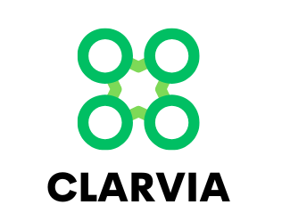

# ♻️ CLAVIRA: Drone-Based Waste Detection Using AI



### Overview  
**CLAVIRA** is an innovative environmental project developed as part of the **Tuwaiq Academy – Operating Drones with Artificial Intelligence Algorithms** program.  
The project explores how **drones combined with computer vision (YOLOv11)** can detect and classify trash across desert environments, promoting sustainability and ecosystem protection.

Human activities such as tourism, camping, and transportation in deserts often lead to **littering**, leaving behind plastics, cans, and bottles that persist for decades. Due to the **vast and hard-to-monitor** nature of deserts, manual detection is nearly impossible.  
CLAVIRA provides an **AI-powered solution** to automate waste detection and mapping, supporting targeted cleanup and environmental conservation efforts.

---

## 🌍 Problem Statement
- Trash in deserts is scattered, often half-buried by sand, and hard to locate.  
- Remote desert areas **lack structured waste management systems**.  
- Accumulated litter **pollutes ecosystems, harms wildlife,** and contributes to **climate change** through greenhouse gas emissions.  

---

## 💡 Our Solution
**CLAVIRA** combines drone technology with **YOLOv11**, an advanced AI vision model, to identify and classify waste in real time.

### 🛠 How It Works
1. **Drone Flight:** Drones capture aerial images and videos of desert environments.  
2. **Image Processing:** Visual data is pre-processed for optimal model input.  
3. **AI Detection:** The YOLOv11 model identifies and classifies waste (e.g., bottles, cans, plastics).  
4. **Actionable Insights:** Enables **targeted cleanup operations** and supports conservation initiatives.

---

## 🧠 Technical Implementation

**Model:** YOLOv11 (You Only Look Once – Real-time Object Detection)  
**Dataset:** Custom-labeled dataset “GARBAGE CLASSIFICATION 3”  

**Training Parameters, Future Work, Team & References:**
```python
# Training Parameters
epochs = 40
batch = 16
imgsz = 640
patience = 5
augment = True
cos_lr = True
single_cls = True

# 🎯 Future Work
# 🤖 Autonomous Collection: Integrate ground robots with drones for automated waste retrieval.
# 🏛 Policy & Community Engagement: Collaborate with governments and NGOs to expand the system’s impact.
# 📈 Advanced Classification: Extend the dataset for multi-class waste recognition and improved model accuracy.

# 👩‍💻 Team CLAVIRA
# Ghala Alsugair
# Reema Altuwajiri
# Seba Almousa
# Madawi Alkhalaf

# 🧾 References
# 1. Jambeck, J. R., et al. (2015). Plastic waste inputs from land into the ocean. Science, 347(6223), 768–771.
# 2. United Nations Environment Programme (UNEP). (2019). Waste Management Outlook for the Middle East and North Africa.
# 3. Ritchie, H., & Roser, M. (2018). Plastic Pollution. Our World in Data.
# 4. Nguyen, T., et al. (2021). Autonomous robotic systems for environmental monitoring and waste management. Robotics and Autonomous Systems, 136, 103710.
# 5. Alharbi, S., et al. (2022). Towards Real-Time Image Mining for Waste Detection in Deserts. Proceedings of the International Conference on Computer Vision Systems.
